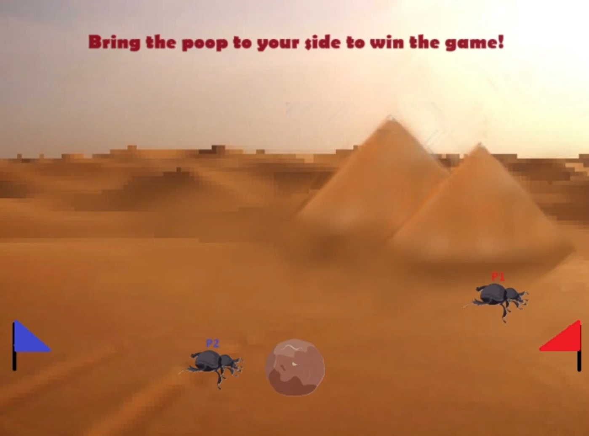

# Dung Beetle

A 2-player SDL/C++ mini game where two dung beetles compete to grab the poop, fight each other, and bring it back to their side to win.

## Game Overview

This project is built with **C++** and **SDL2**. The game includes multiple states such as start screen, intro screen, title screen, gameplay screen, and win screens.

Players control two beetles:

- **Bug 1** starts on the right side.
- **Bug 2** starts on the left side.
- The goal is to pick up the poop and carry it back to your own side.
- When carrying the poop, the beetle moves slower.
- Players can attack or counterattack depending on whether they are holding the poop.

## Demo

### Full Gameplay Video
[]
(https://www.youtube.com/watch?v=dA7Iwm9VA5I)

## Features

- 2-player local gameplay
- SDL2 rendering
- Sprite-based characters and background
- Collision detection
- Jumping and gravity
- Attack and counterattack system
- Game state system:
  - Start
  - Intro
  - Title
  - Gameplay
  - Bug 1 Win
  - Bug 2 Win
  - Exit

## Controls

### Bug 1

| Action | Key |
|---|---|
| Move Left | Left Arrow |
| Move Right | Right Arrow |
| Jump | Up Arrow |
| Attack | Space |
| Counterattack | J |

### Bug 2

| Action | Key |
|---|---|
| Move Left | A |
| Move Right | D |
| Jump | W |
| Attack | J |
| Counterattack | Space |

## How to Play

1. Download `dung beetle.zip`.
2. Unzip the file.
3. Run the game executable.
4. Press `Enter` to move through the start, intro, and title screens.
5. During the game, grab the poop and carry it back to your side.
6. After a player wins:
   - Press `Enter` to restart.
   - Press `Esc` to exit.

## Project Structure

```txt
Dung-Beetle/
├── img/              # Game images and sprites
├── Bug2.cpp/.h       # Bug 2 player logic
├── Foo.cpp/.h        # Bug 1 player logic
├── Poop.cpp/.h       # Poop object logic
├── LTexture.cpp/.h   # Texture loading and rendering helper
├── sample.cpp        # Main game loop and game states
├── dung beetle.zip   # Playable game package
└── README.md
